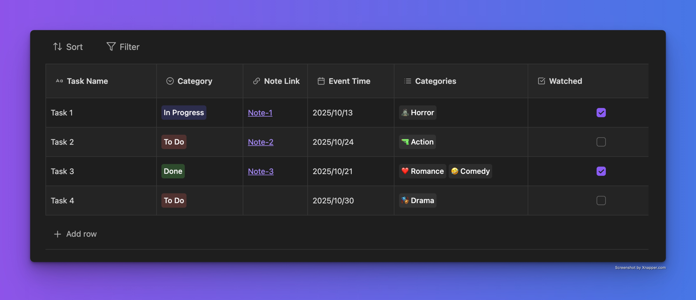
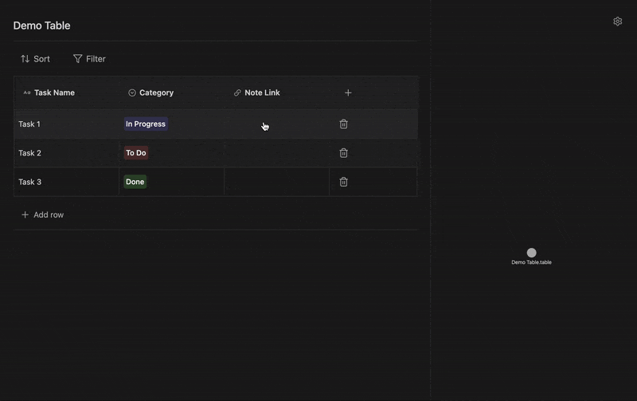

# Tables for Obsidian

A powerful table plugin for Obsidian that lets you create, manage, and visualize structured data with an intuitive interface.



## ✨ Features

### Multiple Column Types
- **Text** - Simple text input
- **Checkbox** - Boolean values
- **Dropdown** - Single selection from predefined options
- **Multi-select** - Multiple selections from predefined options
- **Note Link** - Link to other notes in your vault
- **Date** - Date picker with customizable format

### 🎯 Table Management
- **Add/Delete Rows & Columns** - Flexible data structure management
- **Drag to Reorder** - Intuitive drag-and-drop column reordering
- **Resize Columns** - Adjust column widths to fit your content
- **Inline Renaming** - Rename tables directly in the view
- **Smart Linking** - Automatic backlink updates when notes are renamed or deleted

### 🔍 Data Operations
- **Advanced Sorting** - Multi-level sorting with ascending/descending order
- **Powerful Filtering** - Complex filter rules with multiple conditions
- **Persistent State** - Scroll position and view state preserved during edits
- **Real-time Updates** - Changes save automatically as you type

### 📁 File Formats
- **`.table.md`** (Default) - Maximizes Obsidian compatibility with backlinks and graph view
- **`.table.json`** - Alternative format for faster performance

### 🔗 Graph View Integration

Tables seamlessly integrate with Obsidian's graph view through note link columns:



## 🚀 Quick Start

### Creating Your First Table

1. **Right-click** in your file explorer or use the command palette
2. Select **"New table"**
3. Start adding columns with different data types
4. Add rows and populate your data

### Keyboard Shortcuts & Tips

- **Click any cell** to start editing
- **Tab** to move to the next cell
- **Enter** in text fields to save
- **Drag column headers** to reorder
- **Right-click table files** for quick actions

## 📚 Usage Guide

### Working with Columns

**Add a Column**
- Click the **"+"** button in the table header
- Choose from 6 column types: Text, Checkbox, Dropdown, Multi-select, Note Link, or Date
- Customize options for dropdown and multi-select columns with color-coded tags

**Edit a Column**
- Click the column name to rename
- Click settings to modify column properties
- Delete columns when no longer needed

### Managing Data

**Rows**
- **Add**: Click "Add row" at the bottom
- **Delete**: Click the trash icon on any row
- **Reorder**: Use drag handles (coming soon)

**Filtering & Sorting**
- **Filter**: Build complex queries with multiple conditions (equals, contains, greater than, etc.)
- **Sort**: Multi-level sorting by any column
- Combine multiple filters for precise data views

## 📦 Installation

### Community Plugins (Recommended)

1. Open **Settings** → **Community plugins**
2. Click **"Browse"** and search for **"Tables"**
3. Click **"Install"** then **"Enable"**

### Manual Installation

1. Download the latest release from [GitHub Releases](https://github.com/aztekgold/obsidian-tables/releases)
2. Extract `main.js`, `manifest.json`, and `styles.css` to `<vault>/.obsidian/plugins/tables/`
3. Reload Obsidian
4. Enable the plugin in **Settings** → **Community plugins**

## 🛠️ Development

Want to contribute or customize the plugin?

```bash
# Clone the repository
git clone https://github.com/aztekgold/obsidian-tables.git

# Install dependencies
npm install

# Build for development (auto-rebuilds on changes)
npm run dev

# Build for production (minified)
npm run build
```

## 💬 Support & Feedback

Found a bug or have a feature request? 

- [Open an issue](https://github.com/aztekgold/obsidian-tables/issues) on GitHub
- [Discussions](https://github.com/aztekgold/obsidian-tables/discussions) for questions and ideas

## 📝 License

MIT License - see [LICENSE](LICENSE) file for details.

## 👤 Author

Created with ❤️ by [Aztekgold](https://github.com/aztekgold)

## Support

If you enjoy using Obsidian Tables consider [Buy me a coffee](https://www.buymeacoffee.com/aztekgold)

<a href="https://www.buymeacoffee.com/aztekgold" target="_blank">
  
</a>

---

**⚠️ Important**: This plugin stores table data within your vault files. Always back up your vault regularly!

