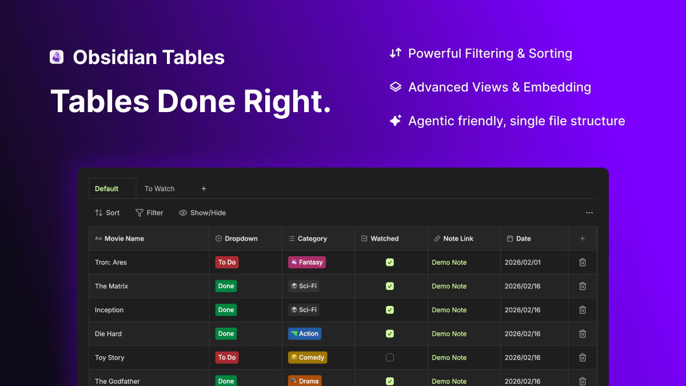
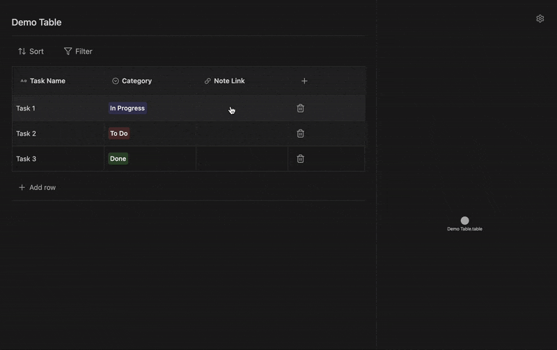

# Tables for Obsidian

Notion-style tables for Obsidian.

I built this to fill a gap in my own workflow, somewhere between a spreadsheet and Obsidian Bases. Sometimes you have structured data that doesn't warrant a Markdown file for every row: a book list, a project tracker, a contacts sheet, a product catalogue. That's what Tables is for.

Because the data lives in a single JSON file, it stays portable and future-proof. You can open it in any text editor and read it without Obsidian. In some ways it's more resilient than a Base. If Obsidian ever disappeared, the relationships between Markdown files would go with it, but everything in a Table stays intact in one place. And whenever you need to get the data out, you can export to CSV in a single click.

Being a single self-contained file also makes it a natural fit for agentic workflows. An agent can read, create, update, and reason over your table data without needing to traverse a web of linked notes.

Think of it as the middle ground: more functionality than Markdown tables, more structure than free-form notes, more portable than a database, less overhead than a spreadsheet. Without the functions, for now. 🙂

## Support

If you enjoy using Obsidian Tables consider [Buy me a coffee](https://www.buymeacoffee.com/aztekgold)

## ✨ Features

### Multiple Column Types
- **Text** - Simple text input
- **Number** - Numeric values with keyboard and clipboard validation
- **Checkbox** - Boolean toggle
- **Select** - Single selection from predefined options with custom colours
- **Multi-select** - Multiple selections from predefined options with custom colours
- **URL** - Renders as a clickable external link when the value matches a URL pattern
- **Email** - Renders as a `mailto:` link when the value matches an email address
- **Note Link** - Link to other notes in your vault
- **Date** - Date picker with customisable format

### 📊 Views & Embeds
- **Multiple Views**: Create different perspectives of your data (e.g., "Active Tasks", "Completed Items") within the same table file.
- **Inline Tables**: Tables render directly in Live Preview for seamless editing.
- **Linked Embeds**: Embed your table in any other note using standard Obsidian embed syntax `![[MyTable.table.md]]`. The embedded table is fully interactive.
- **Embed View Pinning**: Use the alias slot to target a specific view — or create a new one automatically:
  - `![[MyTable.table.md|Sprint Board]]` — pins the embed to the "Sprint Board" view, creating it if it doesn't exist.
  - `![[MyTable.table.md]]` — renders the default (first) view.

### 🎯 Table Management
- **Add/Delete Rows & Columns** - Flexible data structure management
- **Drag to Reorder Rows** - Intuitive drag-and-drop row reordering
- **Drag to Reorder Columns** - Rearrange columns by dragging the header
- **Resize Columns** - Adjust column widths to fit your content
- **Inline Renaming** - Rename tables directly in the view
- **Smart Linking** - Automatic backlink updates when notes are renamed or deleted
- **Advanced Sorting** - Multi-level sorting with ascending/descending order
- **Powerful Filtering** - Complex filter rules with multiple conditions
- **Real-time Updates** - Changes save automatically as you type

### 🔗 Graph View Integration

Tables integrate with Obsidian's graph view through note link columns:

## 🚀 Quick Start

### Creating Your First Table

1. **Right-click** in your file explorer or use the command palette
2. Select **"New table"**
3. Start adding columns with different data types
4. Add rows and populate your data

## 📚 Usage Guide

### Working with Columns

**Add a Column**
- Click the **"+"** button in the table header
- Choose from 9 column types: Text, Number, Checkbox, Select, Multi-select, URL, Email, Note Link, or Date
- Customise options and colours for Select and Multi-select columns

**Edit a Column**
- Click the column name to rename or modify column properties
- Delete columns when no longer needed

### Managing Data

**Rows**
- **Add**: Click "Add row" at the bottom
- **Delete**: Click the trash icon on any row
- **Reorder**: Drag rows using the handle on the left (enable in settings)

**Filtering & Sorting**
- **Filter**: Build complex queries with multiple conditions (equals, contains, greater than, etc.)
- **Sort**: Multi-level sorting by any column
- Combine multiple filters for precise data views

## 📦 Installation

### Community Plugins (Coming Soon)

1. Open **Settings** → **Community plugins**
2. Click **"Browse"** and search for **"Tables"**
3. Click **"Install"** then **"Enable"**

### Manual Installation

1. Download the latest release from [GitHub Releases](https://github.com/aztekgold/obsidian-tables/releases)
2. Extract `main.js`, `manifest.json`, and `styles.css` to `<vault>/.obsidian/plugins/tables/`
3. Reload Obsidian
4. Enable the plugin in **Settings** → **Community plugins**

## 💬 Support & Feedback

Found a bug or have a feature request? 

- [Open an issue](https://github.com/aztekgold/obsidian-tables/issues) on GitHub
- [Discussions](https://github.com/aztekgold/obsidian-tables/discussions) for questions and ideas

## 📝 License

MIT License - see [LICENSE](LICENSE) file for details.

## 👤 Author

Created with ❤️ by [Aztekgold](https://github.com/aztekgold)

---

**⚠️ Important**: This plugin stores table data within your vault files. Always back up your vault regularly!

